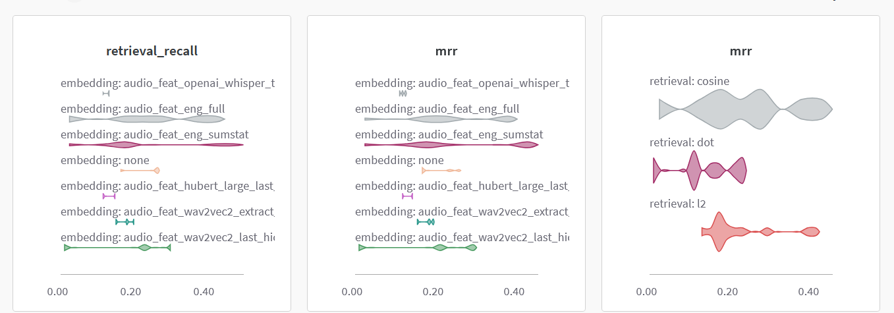

# Module 3 practice 

We've done the following experiments in `experiments/experiments.ipynb`:
- Types of retrieval: l2, cosine, dot
- Types of embedding: none, audio engineered features (MFCC, chroma, spectogram), pre-trained models (Wav2Vec2, hubert, OpenAI Whisper tiny)

Based on the performance chart below, the summary statistics of the engineered features with cosine works the best.
